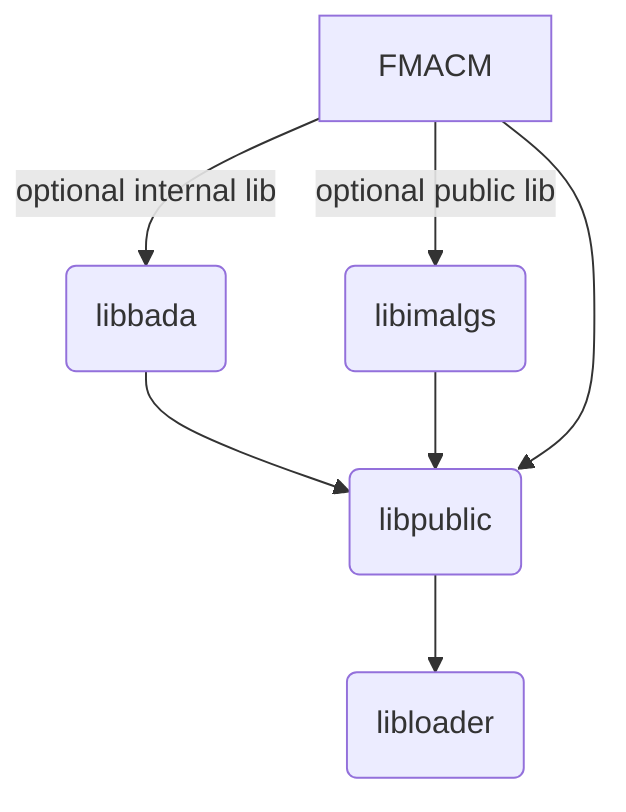

# FIM MOPS Aircraft and Control Model (FMACM)

This library (`framework`) and executable binary (`FMACM`) are part of an [open source](https://mitre.github.io/FMACM/) capability offered by MITRE to external parties. The usage agreement is governed by the Apache 2.0 License (see online documentation). 

Important concepts:
* absolutely no MITRE-IP is allowed in this code base;
* this code must be able to compile _outside of MITRE_ which means we do not allow required dependencies on internal libraries;
   * OPTIONAL dependencies on internal libraries are acceptable to support internal testing tasks

The dependency map should look like this:

