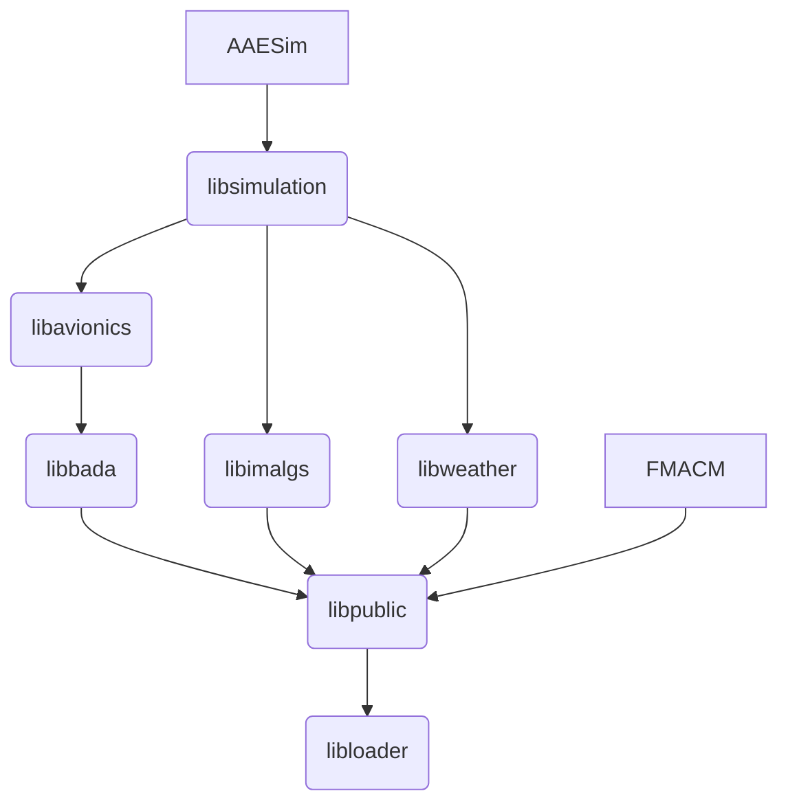

# Developer Notes

This document is expected to be maintained by developers. All content is for developers & assumes knowledge of the basics. Each folder in this repo contains its own `dev-notes.md` document. Each document contains content specific to the directory it resides in. 

## Behavior Expectations

If you are here, you are a professional developer who is expected to know, understand, and abide by the following while working on `AAESim`:

* The `main` branch represents the most recent, valid work.
* We use pull requests with team reviewers for changes to `main`.
   * Pull requests with failing tests are not allowed to be merged. All tests must pass prior to merging a PR.
   * All developers are empowered to participate in open PRs and provide critical feedback.
* We develop code using [SOLID principles](https://www.baeldung.com/solid-principles) as applied [to C++](https://platis.solutions/blog/2020/06/22/how-to-write-solid-cpp/).
* In this code base, a C++ `struct` is used to define interface behaviors and interactions between objects. Always seek to write code using a `struct` and an extension from that `struct`.
* We include as few external dependencies as possible and we include _no_ system dependencies other than the standard library.
   * All dependencies must be defined in the build system and available from a URL.
* We use the C++ standard library extensively for looping, sorting, mapping, &c. Learn it & love it.
* We include small unit tests as we write new code (test driven development)
   * Small tests produce code coverage results [on bamboo](https://pandafood.mitre.org/browse/AAES-UNIT2/latest/artifact).
* We include large regression tests as needed for large scale health checks. 
   * Large tests produce pass/fail metrics per scenario and per data column in the tested output files.
* We use [statistical regression](https://pandafood.mitre.org/browse/AAES-SR2) to track the statistical behavior of the simulation over time.
* We use `pre-commit` to check code quality during every commit operation. The one-time setup requires you to run this: 

```bash
source .scripts/bootstrap.sh
```

## Libraries

`AAESim` is a binary composed of multiple libraries. Virtually all of the code for the binary is contained in the libraries, so understanding each one is important as well as their relationships to each other. Here's a [mermaid](https://mermaid.js.org/) diagram that shows the dependency mapping (looks best in a rendered view).



The diagram above is read like this: 

* Library `libloader` is a base module that all others depend upon. Read more [here](./Loader/dev-notes.md).
* Library `libpublic` depends upon `libloader`. Read more [here](./Public/dev-notes.md).
* Library `libbada` depends upon `libpublic` to build. Read more [here](./Bada/dev-notes.md).
* Library `libimalgs` depends upon `libpublic` to build.  Read more [here](./IntervalManagement/dev-notes.md).
* Library `libweather` depends upon `libpublic` to build.  Read more [here](./Weather/dev-notes.md).
* Library `libavionics` depends upon `libbada` to build. Read more [here](./Avionics/dev-notes.md).
* Library `libsimulation` depends upon `libavionics` & `libimalgs` to build. Read more [here](./AAESim/dev-notes.md).
* `FMACM` is a binary that links against the library `libpublic`.
* `AAESim` is a binary that links every library offered.

> NOTE: Be careful that your `#include` statements do not break this dependency map.

You can also use `cmake` to generate the build-time dependency map. From the build directory, run (on linux):

```bash
cmake --graphviz=aaesim_dependency_map.dot ..
dot -Tpng aaesim_dependency_map.dot -o aaesim_dependency_map.png
display aaesim_dependency_map.ps
```

[CMakeGraphVizOptions.cmake](./CMakeGraphVizOptions.cmake) is being used to control the graphviz options.

## AAESim

`AAESim` is a binary, which in C++ means it has a `main(int argc, char *argv[])` entry point as [defined here](./AAESim/main.cpp). 

## FMACM

`FMACM` is a binary, which in C++ means it has a `main(int argc, char *argv[])` entry point as [defined here](./AircraftDynamicsTestFramework/fmacm.cpp). 

`FMACM` is also entirely open-source, which means its own code and all dependencies are published openly. See [github/fmacm](https://mitre.github.io/FMACM) for more information. The FMACM software is also documented in RTCA DO-361A, Appendix G. 

## Testing

Small, fast tests are developed and maintained in the [unittest folder](./unittest/dev-notes.md). These tests are also run by Bamboo [here](https://pandafood.mitre.org/browse/AAES-UNIT2).

Large, slow tests are developed and maintained in the [regression folder](./regression/dev-notes.md). These tests are also run by Bamboo [here](https://pandafood.mitre.org/browse/AAES-REG2).

## Dependencies

External dependencies must be defined as [CPM modules](https://github.com/cpm-cmake/CPM.cmake). Try to avoid system libraries if at all possible. And dependencies should be declared only at the library level needed.

* Scoped Dependency Example: the [wind library](./AAESim/CMakeLists.txt) is only declared as a dependency in the simulation library.
* Global Dependency Example: the [scientific units library](./CMakeLists.txt) is declared as a global dependency.

## Build on Mac

> BLUF: AAESim does not officially support research on Apple operating systems/hardware. But since you are a developer...
>
> * Yes, apple silicon is supported for dev workflows.
> * No, aaesim results have not been validated on arm64.

To enable this workflow, use `brew` to install [eccodes](https://formulae.brew.sh/formula/eccodes). Optionally, you can also compile with [gcc](https://formulae.brew.sh/formula/gcc@8) (version 8.5 or greater is required).

To run tests, make sure test data have also been installed.

* [wind data](https://mustache.mitre.org/projects/AAES/repos/regression_input_data/browse)
* [bada data](https://mustache.mitre.org/projects/AAES/repos/bada-data/browse)

Then, try this:

```bash
cmake -S. -Bbuild -DCMAKE_C_COMPILER=gcc -DCMAKE_CXX_COMPILER=g++ -DCMAKE_BUILD_TYPE=Release -DBUILD_SHARED_LIBS:BOOL=FALSE
cmake --build build --target FMACM aaesim run_tests
```

And notice also that we are validating the ability to build on MacOs using this [unittest plan on Bamboo](https://pandafood.mitre.org/browse/AAES-UNIT2). Please try to maintain this developer workflow by writing code that cross-compiles!
